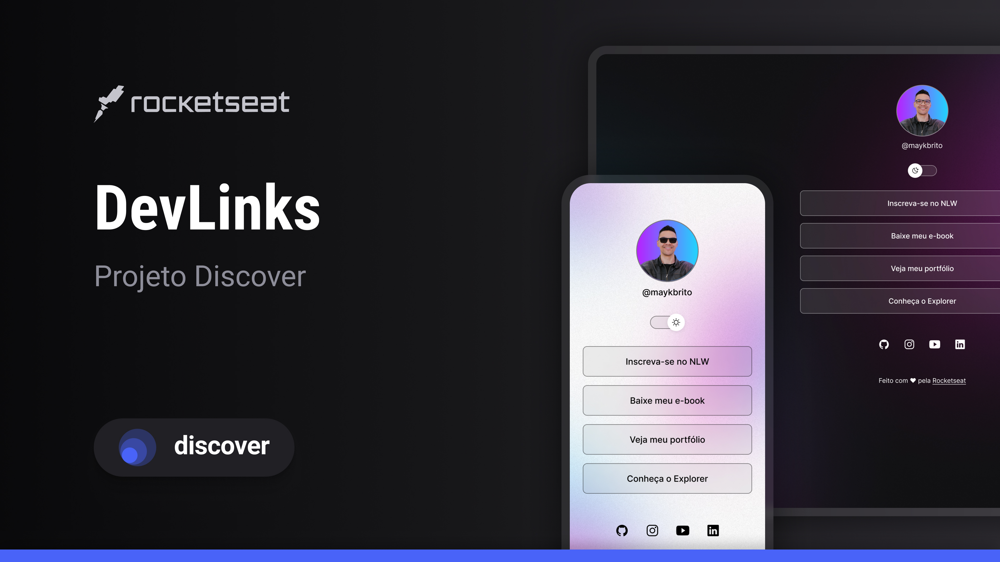

<h1 align="center">🔗 Meu LinkTree</h1>

  <strong>Agregador de links pessoal - Cartão de visitas online</strong>

  

 

  

## 📋 Sobre

Este é meu cartão de visitas online onde você pode encontrar todos os meus links importantes em um só lugar:

- 🚀 **Portfolio** - Meus projetos no GitHub
- 🎮 **Gaming** - Lives na Twitch  
- 📚 **Educação** - Cursos que recomendo
- 📧 **Contato** - Email para parcerias
- 📱 **Redes Sociais** - Instagram, LinkedIn e mais

## 🚀 Tecnologias

Este projeto foi desenvolvido com:

- **HTML5** - Estrutura semântica
- **CSS3** - Estilização e responsividade  
- **JavaScript** - Interatividade (modo claro/escuro)
- **GitHub Pages** - Deploy automático

## ✨ Funcionalidades

- ✅ Design responsivo para mobile e desktop
- ✅ Modo claro e escuro
- ✅ Links para redes sociais
- ✅ Animações suaves
- ✅ Fácil de personalizar

## 📱 Como usar

1. Acesse: [alessandro-krepk.github.io/Projeto-linktree](https://alessandro-krepk.github.io/Projeto-linktree/)
2. Navegue pelos links do meu portfolio, redes sociais e contatos
3. Use o botão toggle para alternar entre modo claro e escuro

## 🤝 Conecte-se comigo

- **GitHub**: [@Alessandro-krepk](https://github.com/Alessandro-krepk)
- **LinkedIn**: [Alessandro França](https://www.linkedin.com/in/alessandro-lu%C3%ADs-fran%C3%A7a-krepk-45522a300/)
- **Instagram**: [@alessandro__franca](https://www.instagram.com/alessandro__franca/)
- **Twitch**: [BadXiter](https://www.twitch.tv/BadXiter)
- **Email**: alessandro1dev@gmail.com

---

  💜 Projeto desenvolvido durante o curso da <a href="https://rocketseat.com.br">Rocketseat</a>

